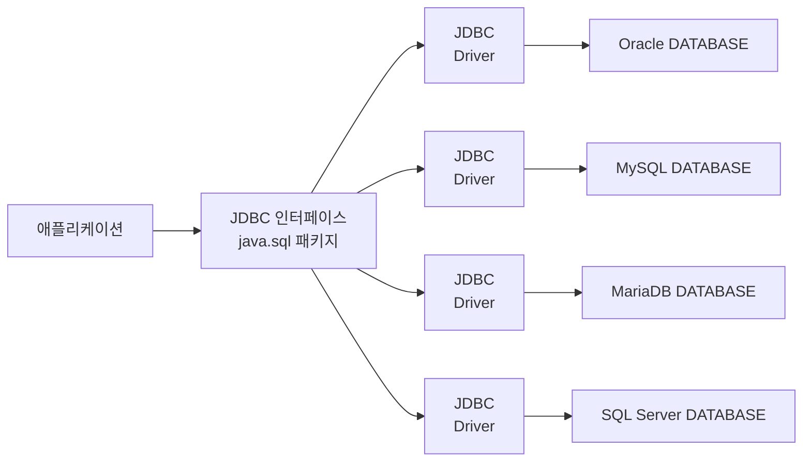

> “**2023년 3월 13일 부터 3월 19일 까지의 나의 루틴.**”

<span style="font-size:30px;">\#**목차**</span>
* this unordered seed list will be replaced by the toc
{:toc}

## 2023-03-13
{:.centered width="100%"}
- 오늘도 어김없이 영한 님의 인강을 들으면서 출근하였다.
- 저번 주 주말 내내 이것이 자바다 공부를 했는데 문득 드는 생각이 너무 정리하면서 공부하려고 해서 늦어지는거 같다는 생각이 들었다.
- 정말 중요하거나 블로그에 적어야할 거 같은 내용만 적고 무슨 챕터를 진행했는지만 블로그에 적으려 한다.

***
### 데이터 입출력
#### 성능 향상 스트림

```java
import java.io.BufferedInputStream;
import java.io.BufferedOutputStream;
import java.io.BufferedReader;
import java.io.BufferedWriter;

public class Example {
    BufferedInputStream bis = new BufferedInputStream(/* 바이트 입력 스트림 */);
    BufferedOutputStream bos = new BufferedOutputStream(/* 바이트 출력 스트림 */);

    BufferedReader br = new BufferedReader(/* 문자 입력 스트림 */);
    BufferedWriter bw = new BufferedWriter(/* 문자 출력 스트림 */);
}
```

Continue with [Buffer Commit](https://github.com/thisiswoo/thisisjava/commit/df01c9dd067194324cf5885bf6287d3bce19a2cd){:target="_blank"}{:.heading.flip-title}
{:.read-more}

```java
import java.io.BufferedReader;
import java.io.FileReader;

public class Example {
    BufferedReader br = new BufferedReader(new FileReader("file path"));
    while (true) {
        String str = br.readLine();  // 파일에서 한 행씩 읽음
        if (str == null) break;     // 더 이상 읽을 행이 없을 경우(파일 끝) while 문 종료
    }
}
```

Continue with [BufferReader Commit](https://github.com/thisiswoo/thisisjava/commit/a3bd83c2ebdfcc7f90e6158a2133f8ccc316308a){:target="_blank"}{:.heading.flip-title}
{:.read-more}

#### 기본 타입 스트림

```java
import java.io.DataInputStream;
import java.io.DataOutputStream;

public class Example {
    DataInputStream dis = new DataInputStream(/* 바이트 입력 스트림 */);
    DataOutputStream dos = new DataOutputStream(/* 바이트 출력 스트림 */);
}
```

Continue with [DataInputOutputStream Commit](https://github.com/thisiswoo/thisisjava/commit/89a2339cdd9a2cc7d5acbb02fe4749375fd744a1){:target="_blank"}{:.heading.flip-title}
{:.read-more}

#### 프린트 스트림

```java
import java.io.PrintStream;
import java.io.PrintWriter;

public class Example {
    PrintStream ps = new PrintStream(/* 바이트 출력 스트림 */);
    PrintWriter pw = new PrintWriter(/* 문자 출력 스트림 */);
}
```

Continue with [PrintStream Commit](https://github.com/thisiswoo/thisisjava/commit/e9b85b0b7df809fef906ecdcdb49a7bf6535e562){:target="_blank"}{:.heading.flip-title}
{:.read-more}

#### 객체 스트림

```java
import java.io.ObjectInputStream;
import java.io.ObjectOutputStream;

public class Example {
    ObjectInputStream ois = new ObjectInputStream(/* 바이트 입력 스트림 */);
    ObjectOutputStream oos = new ObjectOutputStream(/* 바이트 출력 스트림 */);
    
    // writeObject로 객체를 직렬화
    // oos.writeObject(/* 객체 */);
    
    // readObject로 역직열화
    // 객체타입 변수 = (객체타입) ois.readObject();
}
```

Continue with [ObjectInputOutputStream Commit](https://github.com/thisiswoo/thisisjava/commit/1f1d2dc28bc80858f4c65560edefcb0277be234a){:target="_blank"}{:.heading.flip-title}
{:.read-more}

***

## 2023-03-14
{:.centered width="100%"}
- 오늘도 어김없이 영한 님의 인강을 들으면서 출근하였다.
- 얼른 이것이 자바다를 끝내고 영한님의 인강을 들으면서 코드를 치면서 정리해보고 싶다는 생각이 들었다.

***
### 데이터 입출력
#### 성능 향상 스트림
##### Serializable 인터페이스

- 자바 직렬화란 자바 시스템 내부에서 사용되는 객체 또는 데이터를 외부의 자바 시스템에서도 사용할 수 있도록 **`바이트(byte)` 형태로 데이터 변환하는 기술**과 **바이트로 변환된 데이터를 다시 객체로 변환하는 기술(`역직렬화`)**을 아울러서 이야기한다.
- 시스템적으로 이야기하자면 JVM(Java Virtual Machine 이하 JVM)의 메모리에 상주(힙 또는 스택)되어 있는 객체 데이터를 바이트 형태로 변환하는 기술과 직렬화된 바이트 형태의 데이터를 객체로 변환해서 JVM으로 상주시키는 형태를 같이 이야기한다.

```java
import java.io.Serializable;

public class Example implements Serializable {
    // 직렬화 : 일렬로 늘어선 바이트 데이터 => | field1 | field2 | field3 | field14 |
    public int field1;
    protected int filed2;
    int filed3;
    private int filed4;
    
    public static int filed5;   // 정적 필드는 직려로하에서 제외
    transient int filed6;       // transient로 선언된 필드는 직렬화에서 제외

}
```

##### serialVersionUID 필드
- 직렬화할 때 사용된 클래스와 역직렬화할 때 사용된 클래스는 기본적으로 동일한 클래스여야 한다.
- 만약 클래스의 이름이 같더라도 클래스의 내용이 다르면 역직렬화에 실패한다.

```java
import java.io.Serializable;

public class Example implements Serializable {
    int filed1;
    int filed2;
}
```

| 예) Member 클래스로 생성한 객체를 직렬화하면<br> 오른쪽 Member 클래스로 역직렬화 할 수 없다.                                                                                     | ---X---> | 그 이유는 오른쪽 Member 클래스에는<br> `filed3`이 있기 때문이다.                                                                                                                                          |
|---------------------------------------------------------------------------------------------------------------------------------------------------|----------|----------------------------------------------------------------------------------------------------------------------------------------------------------------------------------------|
| `public class Member`<br>&nbsp;&nbsp;&nbsp;`implements Serializable {`<br>&nbsp;&nbsp;&nbsp;`int file1;`<br>&nbsp;&nbsp;&nbsp;`int filed2`<br>`}` | ---X---> | `public class Member`<br>&nbsp;&nbsp;&nbsp;`implements Serializable {`<br>&nbsp;&nbsp;&nbsp;`int filed1;`<br>&nbsp;&nbsp;&nbsp;`int filed2;`<br>&nbsp;&nbsp;&nbsp;`int filed3;`<br>`}` |

- 클래스 내용이 다르다 할지라도 직렬화된 필드를 공통으로 포함하고 있다면 역직렬화할 수 있는 방법이 있다.
- 두 클래스가 동일한 `serialVersionUID` 상수값을 가지고 있으면 된다.

||||
|--------------------------------------------------------------------------------------------------------------------------------------------------------------------------------------------------|----------|-----------------------------------------------------------------------------------------------------------------------------------------------------------------------------------------------------------------------------------------------------|
| `public class Member`<br>&nbsp;&nbsp;&nbsp;`implements Serializable {`<br>&nbsp;&nbsp;&nbsp;`static final long`<br>&nbsp;&nbsp;&nbsp;&nbsp;&nbsp;&nbsp;`derialVersionUID = 1;`<br>&nbsp;&nbsp;&nbsp;`int filed1;`<br>&nbsp;&nbsp;&nbsp;`int filed2;`<br>`}` | ---O---> | `public class Member`<br>&nbsp;&nbsp;&nbsp;`implements Serializable {`<br>&nbsp;&nbsp;&nbsp;`static final long`<br>&nbsp;&nbsp;&nbsp;&nbsp;&nbsp;&nbsp;`serialVersionUID = 1;`<br>&nbsp;&nbsp;&nbsp;`int filed1;`<br>&nbsp;&nbsp;&nbsp;`int filed2;`<br>&nbsp;&nbsp;&nbsp;`int filed3`<b>`}` |

#### File과 Files 클래스
##### File 클래스

```java
import java.io.File;

public class Example {
    File file = new File("path");
    
    // max path : /
    File macFile = new File("user/dev/thisisjava/test.txt");
    
    // window path : \\ or /
    File windowFile1 = new File("C:/Temp/file.txt");
    File windowFile2 = new File("C:\\Temp\\file.txt");
    
    // 파일이나 폴더가 존재한다면 true를 리턴
    boolean isExist = file.exists();
}
```

Continue with [File Class Commit](https://github.com/thisiswoo/thisisjava/commit/700d869fa2c3d94be86e7ff6ecac34ac95c92fef){:target="_blank"}{:.heading.flip-title}
{:.read-more}

###### 입출력 스트림을 생성할 때 File 객체 활용하기
- 파일 또는 폴더의 정보를 얻기 위해 `File` 객체를 단독으로 사용할 수 있지만, 파일입출력 스트림을 생성할 때 경로 정보를 제공할 목적으로 사용되기도 한다.

```java
import java.io.File;
import java.io.FileInputStream;

public class Example {
    // 첫 번째 방법
    FileInputStream fis = new FileInputStream("filepath");
    // 두 번째 방법
    File file = new File("filepath");
    FileInputStream fileFis = new FileInputStream(file); 
}
```

##### Files 클래스
- `Files` 클래스는 정적 메서드로 구성되어 있고, `File` 보다 좀 더 많은 기능을 제공한다.

```java
public class Example {
    Path path = Path.get(String first, String... more);

    // 예)
    Path path = Path.get("C:/Temp/dir/file.txt");
    Path path = Path.get("C:/Temp/dir", "file.txt");
    Path path = Path.get("C", "Temp", "dir", "file.txt");

    // 절대 경로와 상대 경로
    Path path = Path.get("dir/file.txt");
    Path path = Path.get("./dir/file.txt"); 
    Path path = Path.get("../dir/file.txt"); 
    
}
```

Continue with [Files Class Commit](https://github.com/thisiswoo/thisisjava/commit/9afcbd79e92407620bbf892dd2e3dbef9867c8d1){:target="_blank"}{:.heading.flip-title}
{:.read-more}

### 네트워크 입출력
#### 네트워크 기초
- **LAN**<sub>`Local Area Network`</sub>은 가정, 회사, 건물, 특정 여역에 존재하는 컴퓨터를 연결하는 것이다.
- **WAN**<sub>`Wide Area Network`</sub>은 `LAN`을 연결한 것으로, 쉽게 말해 **인터넷**<sub>`Internet`</sub>이다

##### 서버와 클라이언트
- 서비스를 **제공**하는 프로그램을 일반적으로 **서버**<sub>`Server`</sub>라고 한다.
- 서비스를 **요청**하는 프로그램을 **클라이언트**<sub>`Client`</sub>라고 한다.
- 인터넷에 두 프로그램이 통신하기 위해서는 먼저 클라이언트가 서비스를 요청하고, 서버는 처리결과를 응답으로 제공해준다.

##### IP 주소
- **IP**<sub>Internet Protocol</sub>는 컴퓨터의 고유한 주소이다.
- Mac에서는 `ifconfig`, Window에서는 `ipconfig`를 터미널/CMD창에서 검색하게 되면 `ip` 정보를 볼 수 있다.
- **DNS**<sub>Domain Name System</sub>는 도메인 이름으로, `IP`를 등록하는 저장소이고, 컴퓨터의 `IP` 주소를 검색한다.
- 대중에게 서비스를 제공하는 대부분의 컴퓨터는 다음과 같이 도메인 이름으로 `IP`를 미리 `DNS`에 미리 등록해 놓는다.

| 도메인 이름          | `IP`주소          |
|-----------------|-----------------|
| `www.naver.com` | `222.122.195.5` |

- 웹 브라우전즌 웹 서버와 통신하는 클라이언트로, 상요자가 입력한 도메인 이름으로 `DNS`에서 `IP` 주소를 검색해 찾는 다음 웹 서버와 연결해서 웹 페이지를 받는다.

***

## 2023-03-15
{:.centered width="100%"}
- 오늘도 어김없이 영한 님과...🤩

***
### 네트워크 입출력
#### 네트워크 기초
##### Port 번호
- `Port`는 운영체제가 관리하는 서버 프로그램의 연결 번호이다.
- 서버는 시작할 때 특정 `Port` 번호에 바인딩 한다.
- 클라이언트도 서버에서 보낸 정보를 받기 위해서는 `Port` 번호가 필요한데, 서버와 같이 고정적인 `Port` 번호에 바인딩하는 것이 아니라 운영체제가 자동으로 부여하는 번호를 사용한다.
- 이 번호는 클라이언트가 서버로 요청할 때 함게 전송되어 서버가 클라이언트로 데이터를 보낼 때 사용된다.

#### IP 주소 얻기
- `Java`는 `IP` 주소를 `java.net` 패키지의 `InetAddress`로 표현한다.
- `InetAddress`를 이용하면 로컬 컴퓨터의 `IP` 주소를 얻을 수 있고, 도메인 이름으로 `DNS`에서 검색한 후 `IP` 주소를 가져올 수도 있다.

```java
import java.net.InetAddress;

public class Example {
    // local 컴퓨터의 InetAddress를 얻고 싶을 때
    InetAddress is = InetAddress.getLocalHost();
    
    // 컴퓨터의 도메인 이름을 알고 있다면 두 개의 메서드를 사용하여 InetAddress 객체를 얻을 수 있다.
    InetAddress is = InetAddress.getByName(String domainName);          // 단 하나의 IP 주소를 get
    InetAddress[] iaArr = InetAddress.getAllByName(String domainName);  // 등록된 모든 IP 주소를 배열로 get
    
    // 위 메서드들로부터 얻은 InetAddress 객체에서 IP 주소를 얻고 싶을 때
    String ip = InetAddress.getHostAddress();
}
```

Continue with [IP 주소 얻기 Commit](https://github.com/thisiswoo/thisisjava/commit/301e3f4fd2477608993ad8fec2d0bdf555f71df8){:target="_blank"}{:.heading.flip-title}
{:.read-more}

#### TCP 네트워킹
- `IP` 주소로 프로그램들이 통신할 때는 약속된 데이터 전송 규약이 있다. 이것을 전송용 **프로토콜**<sub>Protocol</sub>이라고 부른다.
- 인터넷 에서 전송용 프로토콜은 **TCP**<sub>Transmission Control Protocol</sub>와 **UDP**<sub>User Datagram Protocol</sub>가 있다.
- `TCP`는 연결형 프로토콜로, 상대방이 연결된 상태에서 데이터를 주고 바는다.
- `TCP`는 보낸 데이터가 순서대로 전달되며 손실이 발생하지 않는다.
- `TCP`는 웹 브라우저가 웹 서버에 연결할 때 사용되며 이메일 전송, 파일 전송, DB 연동에도 사용된다.
- `Java`는 `TCP` 네트워킹을 위해 `java.net` 패키지에서 `ServerSocket`과 `Socket` 클래스를 제공하고 있다.
- `ServerSocket`은 클라이언트의 연결을 수학하는 서버 쪽 클래스이고, `Socket`은 클라이언트에서 연결 요청할 때와 클라이언트와 서버 양쪽에서 데이터를 주고 받을 대 사용되는 클래스이다.

##### TCP 서버

```java
import java.net.InetSocketAddress;
import java.net.ServerSocket;
import java.net.Socket;

public class Example {
    // 50001번의 port에 바인딩
    ServerSocket serverSocket = new ServerSocket(50001);

    // 기본 생성자로 객체를 생서하고 port 바인딩을 위해 bind() 메서드를 호출
    ServerSocket serverSocket = new ServerSocket();
    serverSocket.bind(new

    InetSocketAddress(50001));

    // 서버 컴퓨터에 여러 개의 IP가 할당되어 있을 경우, 특정 IP에서만 서비스를 하고 싶다면
    ServerSocket serverSocket = new ServerSocket();
    serverSocket.bind(new

    InetSocketAddress("xxx.xxx.xxx.xxx",50001));

    // ServerSocket이 생성되었다면 연결 요청을 수락하기 위해 accept() 메서드를 실행
    Socket socket = serverSocket.accept();
    
    // return된 Socket을 통해 연결된 클라이언트의 IP 주소와 Port 번호를 얻고 싶다면
    InetSocketAddress isa = (InetSocketAddress) socket.getRemoteSocketAddress();
    String clientIp = isa.getHostName();
    String portNo = isa.getPort();
    
    // 서버를 종료하려면 close()
    serverSocket.close();
}
```

Continue with [TCP 서버 Commit](https://github.com/thisiswoo/thisisjava/commit/0c2f8595246b21ba7b6b61f5464c409d935d3636){:target="_blank"}{:.heading.flip-title}
{:.read-more}

##### TCP 클라이언트
- 클라이언트가 서버에 연결 요청을 하려면 `Socket` 객체를 생성할 때 생성자 매개값으로 서버 `IP` 주소와 `Port` 번호를 제공하면 된다.
- 로컬 컴퓨터에서 실행하는 서버로 연결 요청을 할 경우에는 `IP` 주소 대신 `localhost`를 사용할 수 있다.

```java
import java.io.IOException;
import java.net.InetSocketAddress;
import java.net.Socket;

public class Example {
    Socket socket = new Socket("IP", 50001);

    // IP 주소 대신 도메인 이름을 사용하고 싶다면, DNS에서 IP 주소를 검색할 수 있도록 생성자 매개값으로 InetSocketAddress를 제공
    Socket socket = new Socket(new InetSocketAddress("domainName", 50001));

    // Socket 생성과 동시에 연결 요청을 하지 않고 기본 생성자로 Socket을 생성한 후 connect() 메서드로 연결 요청할 수도 있다.
    Socket socket = new Socket();
    socket.connect(new

    InetSocketAddress("domainName",50001));

    // 연결 요청 시 두 가지 예뵈가 발생할 수 있다.
    // UnknownHostException은 IP 주소가 잘못 표기 되었을 때 발생
    // IOException 제공된 IP와 port 번호로 연결할 수 없을 때 발생
    // 따라서 두 가지 예외 모두 처리해야 한다
    try {
        Socket socket = new Socket("IP", 50001);
    } catch(UnknownHostException e) {
        // IP 표기 방법이 잘못되었을 경우
        e.printStackTrace();
    } catch(IOException e) {
        // IP와 Port로 서버에 연결할 수 없는 경우
        e.printStackTrace();
    }
    
    // 서버와 연결된 후에 클라이언트에서 연결을 끊고 싶다면
    socket.close();
}
```

Continue with [TCP 클라이언트 Commit](https://github.com/thisiswoo/thisisjava/commit/56a672a7644b097dcdab57f3f0aab05f441b108d){:target="_blank"}{:.heading.flip-title}
{:.read-more}

##### 입출력 스트림으로 데이터 주고 받기
- 클라이언트가 연결 요청(`connect()`)을 하고 서버가 연결을 수락(`accept()`)했다면 클라이언트와 서버의 양쪽 `Socket` 객체로부터 가각 입력 스트림<sub>InputStream</sub>과 출력 스트림스트림<sub>OutputStream</sub>을 얻을 수 있다.

```java
import java.io.DataInputStream;
import java.io.DataOutputStream;
import java.io.InputStream;
import java.io.OutputStream;
import java.net.Socket;

public class Example {
    Socket socket = new Socket();
    InputStream is = socket.getInputStream();
    OutputStream os = socket.getOutputStream();

    // UTF-8로 인코딩 후 바이트 배열을 얻어내고, write() 메서드로 전송
    String data = "보낼 데이터";
    byte[] bytes = data.getBytes("UTF-8");
    os.write(bytes);
    os.flush();

    // 문자열을 좀 더 간편하게 보내고 싶다면 보조 스트림인 DataOutputStream을 사용
    DataInputStream dos = new DataOutputStream(socket.getOutputStream());
    dos.writeUTF(data);
    dos.flush();
    
    // 받는 데이터가 문자열이라면
    byte[] bytes = new byte[1024];
    int num = is.read(bytes);
    String data = new String(bytes, 0, num, "UTF-8");
    
    // 해당 방법은 상대방이 DataOutputStream으로 문자열을 보낼 때만 가능
    DataInputStream dis = new DataInputStream(socket.getInputStream());
    String data = dis.readUTF();
}
```

Continue with [입출력 스트림으로 데이터 주고 받기 Commit](https://github.com/thisiswoo/thisisjava/commit/ab951e9f290446725fd18b98d0455fc2f9a4137d){:target="_blank"}{:.heading.flip-title}
{:.read-more}

***

## 2023-03-16
- 오늘은 병원 외래 진료 때문에 휴가이다~~🥳🥳🥳

***
### 데이터 입출력
#### UDT 네트워킹
- `UDP`<sub>User Datagram Protocol</sub>는 발신자가 일방적으로 수신자에세 데이터를 보내는 방식.
- `TCP` 처럼 연결 요청 및 수락 과정이 없기 때문에 `TCP`보다 데이터 전송 속도가 상대적으로 빠르다.
- `Java`는 `UDP` 네트어킹을 위해 `java.net` 패키지에서 `DatagramSocket`과 `DatagramPacket` 클래스를 제공하고 있다.
- `DatagramSocket`은 발신점과 수신점에 해당하고 `DatagramPacket`은 주고 받는 데이터에 해당한다.

##### UDP 서버

```java
import java.net.DatagramPacket;
import java.net.DatagramSocket;
import java.net.SocketAddress;

public class Example {
    // DatagramSocket 객체 생성과 port 번호 생성자 매개값
    DatagramSocket datagramSocket = new DatagramSocket(50001);

    // UDP 서버는 클라이언트가 보낸 DatagramPacket을 항상 받을 준비를 해야 한다. 이 역할을 하는 메서드가 receive()이다
    DatagramPacket receivePacket = new DatagramPacket(new byte[1024], 1024);
    datagramSocket.receive(receivePacket);

    // 수신된 데이터와 바이트 수를 얻는 방법 및 문자열
    byte[] bytes = receivePacket.getData();
    int num = receivePacket.getLength();
    String data = new String(bytes, 0, num, "UTF-8");

    // getSocketAddress() 메서드를 호출하면 정보가 담긴 SocketAddress 객체를 얻을 수 있다.
    SocketAddress socketAddress = receivePacket.getSocketAddress();
    
    // 클라이언트로 보맬 Datagrampacket을 생성할 때 네 번째 매개값으로 사용
    String data = "처리 내용";
    byte[] bytes = data.getBytes("UTF-8");
    DatagramPacket sendPacket = new DatagramPacket(bytes, 0, bytes.length, socketAddress);
    
    // 클라이언트에 보낼 때
    datagramSocket.send(sendPacket);
    
    // UDP 종료
    datagramSocket.close();
}
```

##### UDP 클라이언트

```java
import java.net.DatagramPacket;
import java.net.DatagramSocket;
import java.net.InetSocketAddress;

public class Example {
    // 기본생성자
    DatagramSocket datagramSocket = new DatagramSocket();

    // 요청을 보내기 위한 DatagramPacket을 생성
    String data = "요청 데이터";
    byte[] bytes = data.getBytes("UTF-8");
    DatagramPacket sendPacket = new DatagramPacket(
            bytes, bytes.length, new InetSocketAddress("localhost", 50001)
    );
    
    // UDP 서버로 전송
    datagramSocket.send(sendPacket);
    
    // close();
    datagramSocket.close();
}
```

Continue with [UDP 서버/클라이언트 Commit](https://github.com/thisiswoo/thisisjava/commit/088d4d4baeb5821e26e6c018f699eb0c53354fe5){:target="_blank"}{:.heading.flip-title}
{:.read-more}

#### 서버의 동시 요청 처리
##### TCP EchoServer 동시 요청 처리
Continue with [TCP 동시 요청 처리 Commit](https://github.com/thisiswoo/thisisjava/commit/806d09b7be09ce1834d814817fe103c835d40d91){:target="_blank"}{:.heading.flip-title}
{:.read-more}

##### UDP NewsServer 동시 요청 처리
Continue with [UDP 동시 요청 처리 Commit](https://github.com/thisiswoo/thisisjava/commit/d49a3865fb7fe23db69dec76ac2ecc76807c9901){:target="_blank"}{:.heading.flip-title}
{:.read-more}

#### JSON 데이터 형식
- 네트워크 통신에서 가장 많이 사용되는 데이터 형식은 `JSON``<sub>JavaScript Object Notation</sub>이다.

| 표기    | code                                                                                                                                                                 | 설명                                                                                                                                                                          |
|-------|----------------------------------------------------------------------------------------------------------------------------------------------------------------------|-----------------------------------------------------------------------------------------------------------------------------------------------------------------------------|
| 객체 표기 | &#123;<br>&nbsp;&nbsp;&nbsp;&nbsp;&#34;속성명&#34;: 속성값&#44;<br>&nbsp;&nbsp;&nbsp;&nbsp;&#34;속성명&#34;: 속성값&#44;<br>&nbsp;&nbsp;&nbsp;&nbsp;&#183;&#183;&#183;<br>&#125; | 속성명: 반드시&#34;로 감싸야 함<br>속성값으로 가능한 것<br>&#45;&nbsp;&#34;문자열&#34;, 숫자, true/false<br>&#45;&nbsp;객체&#123;&#183;&#183;&#183;&#125;<br>&#45;&nbsp;배열&#91;&#183;&#183;&#183;&#93; |
| 객체 표기 | &#91;항목&#44; 항목&#44; &#183;&#183;&#183;&#93;                                                                                                                         | 항목으로 가능한 것<br>&#45;&nbsp;&#34;문자열&#34;, 숫자, true/false<br>&#45;&nbsp;객체&#123;...&#125;<br>&#45;&nbsp;배열&#91;...&#93;                                                        |

```json
{
  "id": "spring",
  "name": "여름",
  "age": 25,
  "student": true,
  "tel": {
    "home": "02-1234-1234",
    "mobile": "010-1234-1234",
    "skill": [
      "java",
      "spring"
    ]
  }
}
```

### 데이터베이스 입출력
#### JDBC 개요
- `Java`는 데이터베이스(`DB`)와 연결해서 데이터 입출력 작업을 할 수 있도록 `JDBC`<sub>Java Database Connectivity</sub> 라이브러리(`java.sql` 패키지)를 제공한다.




***


## 2023-03-17
## 2023-03-18
## 2023-03-19

[//]: # (## Reference)

[//]: # (- [이것이 자바다]&#40;https://www.youtube.com/watch?v=PqZ1imcTBpI&list=PLVsNizTWUw7EmX1Y-7tB2EmsK6nu6Q10q&#41;{:target="_blank"})

[//]: # ()
[//]: # ()
[//]: # (Back to [[Routine] 8 주차 시작!]&#40;./2023-03-05-week-7th.md&#41;{:.heading.flip-title})

[//]: # ({:.read-more})

[//]: # ()
[//]: # ()
[//]: # (Continue with [[Routine] 10 주차 시작!]&#40;./2023-03-13-week-9th.md&#41;{:.heading.flip-title})

[//]: # ({:.read-more})